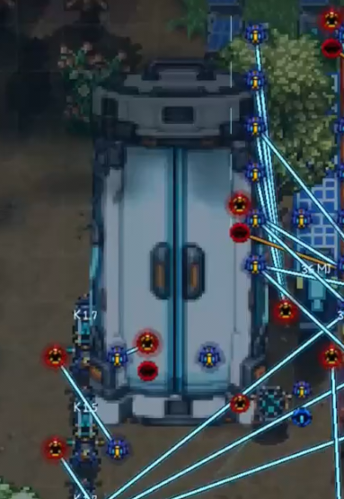
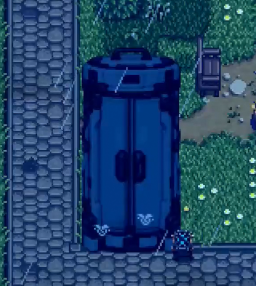

#Bản mod vẫn đang được phát triển

Wiring Tool bổ sung mạng điện, dây tín hiệu, cổng logic, cảm biến và nhiều thiết
bị công nghệ cao. Bạn có thể tự thiết kế mọi thứ, từ một chiếc đèn tự bật khi
trời tối cho đến cổng dịch chuyển và cỗ máy đưa bạn tới tương lai.

## Tính năng

### Smart Glasses 

Mang Smart Glasses trong túi và nhấn `G` để kích hoạt Edge Vision. Một làn sóng
quét công nghệ cao sẽ mở ra chế độ nối dây, giúp bạn nhìn thấy các cổng kết nối,
trạng thái tín hiệu và thông số điện của từng thiết bị ngay trong thế giới game.

- Nhấp chuột trái vào một cổng Output, sau đó chọn một cổng Input cùng loại để
  nối dây.
- Nhấp chuột phải vào cổng hoặc trực tiếp lên dây để tháo kết nối.
- Nhấn `G` lần nữa để tắt Edge Vision.

Smart Glasses được bán qua chương trình **Jojo Home Shopping** trên TV vào lúc
**21:00 Chủ nhật**. Sau khi đặt mua, kính sẽ được giao vào sáng hôm sau.

### Xây dựng mạng điện

Tạo nguồn điện cho nông trại bằng Solar Generator, Wind Turbine hoặc Solar Panel
có sẵn trong Stardew Valley. Năng lượng mặt trời thay đổi theo thời gian và thời
tiết, còn turbine gió sẽ quay theo lượng điện đang tạo ra.

Mạng điện có thể được mắc nối tiếp, song song hoặc chia thành nhiều nhánh. Điện
áp, dòng điện và công suất đều ảnh hưởng trực tiếp đến hoạt động của thiết bị.
Nếu cấp thiếu điện, thiết bị có thể ngừng chạy; nếu cấp sai điện áp, Edge Vision
sẽ giúp bạn nhận ra vấn đề.

Các thiết bị hỗ trợ quản lý năng lượng gồm:

- **Energy Storage:** lưu trữ điện để sử dụng khi nguồn tái tạo không hoạt động.
- **Energy Meter:** đo điện áp, dòng điện, điện trở và công suất của mạng.
- **Bộ điều áp:** tăng hoặc giảm điện áp đầu ra để phù hợp với từng loại thiết
  bị.

### Tự động hóa bằng cổng logic

Mod bổ sung nhiều khối logic để bạn xây dựng hệ thống điều khiển theo ý muốn:

- AND, OR, NOT, XOR, NAND, NOR, XNOR và Buffer.
- Timer Gate với chu kỳ có thể điều chỉnh từ 0,1 đến 2 giây.
- SR Latch và D-Latch để ghi nhớ trạng thái.
- Countdown Timer có thời gian từ 1 đến 5 giây.
- Delay Gate để trì hoãn thay đổi tín hiệu.
- Wire Switch để bật hoặc tắt hệ thống thủ công.

Bạn có thể kết hợp các cổng này để tạo cửa tự động, hệ thống chiếu sáng, bộ hẹn
giờ, máy móc chỉ hoạt động khi đủ điều kiện và nhiều cơ chế phức tạp hơn.

### Cảm biến 

- **Light Sensor:** nhận biết môi trường sáng hoặc tối.
- **Liquid Sensor:** phát hiện trời mưa hoặc nước ở gần.
- **Proximity Scanner:** phát hiện người, NPC và sinh vật trong bán kính 4 ô.
- **Pressure Plate:** phát tín hiệu khi có người hoặc sinh vật bước lên.

Kết nối cảm biến với cổng logic để nông trại tự phản ứng với môi trường mà không
cần bạn trực tiếp điều khiển.

### Điều khiển máy móc và đèn có sẵn

Máy chế biến và đèn của Stardew Valley có thể tham gia mạng điện. Bạn có thể cấp
điện cho chúng hoặc điều khiển chúng bằng tín hiệu logic.

Khi mất điện, máy đang xử lý sẽ tạm dừng an toàn và giữ nguyên vật phẩm bên
trong. Khi có điện trở lại, quá trình sẽ tiếp tục từ vị trí đã dừng.

### Music Box

Music Box phát nhạc khi nhận được tín hiệu `PLAY`. Tương tác với hộp nhạc để lựa
chọn giữa 36 nốt thuộc ba quãng âm. Khi có đủ điện và tín hiệu đang bật, thiết
bị sẽ phát âm thanh và chạy hoạt ảnh.

### Teleport Gate

Đặt nhiều Teleport Gate tại các khu vực khác nhau để tạo mạng lưới dịch chuyển
riêng cho nông trại. Cấp đủ điện bước vào trong cổng rồi
tương tác để chọn điểm đến.

Mỗi cổng chiếm khu vực 3×3 và mỗi lần dịch chuyển sẽ tiêu tốn 1M năng lượng.

### Time Machine

Time Machine cho phép bạn tiến tới một thời điểm trong tương lai bằng cách chọn
số năm, ngày, giờ và phút. Bạn phải đứng bên trong buồng máy và cung cấp đủ năng
lượng trước khi khởi động.

Máy không thể đưa bạn về quá khứ và chỉ hoạt động trong chế độ chơi đơn.
Multiplayer và split-screen hiện chưa được hỗ trợ cho tính năng này.

## Bắt đầu xây dựng

Phần lớn cổng logic, cảm biến và thiết bị điện được bán tại JojaMart. Một số
thiết bị cũng có công thức chế tạo được mở tự động.

Hãy bắt đầu với một nguồn điện, Energy Meter và vài cổng logic đơn giản. Khi đã
quen với Edge Vision, bạn có thể mở rộng dần thành một mạng tự động hóa phủ khắp
nông trại.

---

# This mod is still under development

The Wiring Tool adds electrical networks, signal wires, logic gates, sensors, and many other high-tech devices. You can design everything yourself, from a lamp that turns on automatically when it gets dark to teleport gates and a machine that sends you into the future.

## Features

### Smart Glasses

Carry the Smart Glasses in your inventory and press `G` to activate Edge Vision. A high-tech scanning wave will open up wiring mode, letting you see connection ports, signal states, and electrical readings for each device right in the game world.

- Left-click an Output port, then select an Input port of the same type to wire them together.
- Right-click a port or directly on a wire to disconnect it.
- Press `G` again to turn off Edge Vision.

Smart Glasses are sold through the **Jojo Home Shopping** program on TV at **9:00 PM on Sunday**. After ordering, the glasses will be delivered the following morning.

### Building an electrical network

Generate power for your farm using a Solar Generator, Wind Turbine, or Solar Panel available in Stardew Valley. Solar power varies with time and weather, while wind turbines spin according to the amount of electricity being generated.

Electrical networks can be wired in series, in parallel, or split into multiple branches. Voltage, current, and power all directly affect how devices operate. If a device is underpowered, it may stop working; if it receives the wrong voltage, Edge Vision will help you spot the problem.

Devices that support power management include:

- **Energy Storage:** stores electricity for use when renewable sources aren't generating power.
- **Energy Meter:** measures voltage, current, resistance, and power in the network.
- **Voltage Regulator:** steps output voltage up or down to match different types of devices.

### Automation with logic gates

The mod adds many logic blocks so you can build control systems however you like:

- AND, OR, NOT, XOR, NAND, NOR, XNOR, and Buffer.
- Timer Gate with an adjustable cycle from 0.1 to 2 seconds.
- SR Latch and D-Latch for storing state.
- Countdown Timer with a duration from 1 to 5 seconds.
- Delay Gate to delay a signal change.
- Wire Switch to manually turn a system on or off.

You can combine these gates to create automatic doors, lighting systems, timers, machines that only run when certain conditions are met, and other, more complex mechanisms.

### Sensors

- **Light Sensor:** detects whether the environment is bright or dark.
- **Liquid Sensor:** detects rain or nearby water.
- **Proximity Scanner:** detects people, NPCs, and creatures within a 4-tile radius.
- **Pressure Plate:** sends a signal when a person or creature steps on it.

Connect sensors to logic gates so your farm reacts to its environment automatically, without you having to control it directly.

### Controlling existing machines and lights

Stardew Valley's processing machines and lights can be integrated into the electrical network. You can power them or control them using logic signals.

If power is lost, a machine that's processing will pause safely and keep the item inside intact. When power is restored, the process will resume from where it left off.

### Music Box

The Music Box plays music when it receives a `PLAY` signal. Interact with the box to choose from 36 notes across three octaves. When it has enough power and the signal is on, the device will play sound and run its animation.

### Teleport Gate

Place multiple Teleport Gates in different areas to build your own teleportation network across the farm. Supply enough power, step into the gate, then interact with it to choose your destination.

Each gate takes up a 3×3 area, and each teleport consumes 1M of energy.

### Time Machine

The Time Machine lets you travel forward to a specific point in time by selecting the number of years, days, hours, and minutes. You must stand inside the machine's chamber and supply enough power before activating it.

The machine cannot send you back to the past and only works in single-player mode. Multiplayer and split-screen are not currently supported for this feature.

## Getting started

Most logic gates, sensors, and electrical devices are sold at JojaMart. Some devices also have crafting recipes that unlock automatically.

Start with a power source, an Energy Meter, and a few simple logic gates. Once you're comfortable with Edge Vision, you can gradually expand into a full automation network covering your entire farm.
